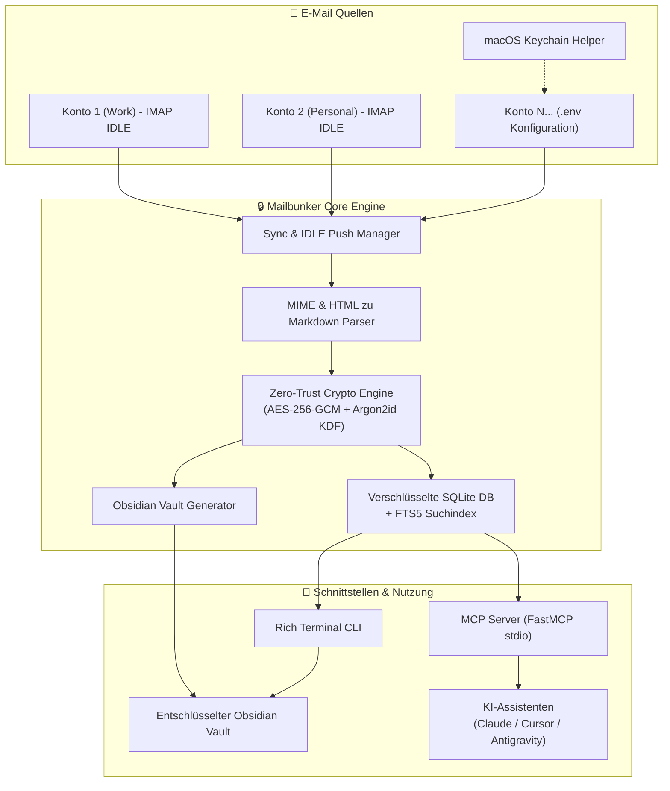

# 🔒 Mailbunker

<div align="center">

# 📬 Mailbunker MCP
### *Dein privates, Zero-Trust verschlüsseltes E-Mail-Archiv & KI-Knowledge-Vault*

**Verwandle deine E-Mails in Echtzeit in eine verschlüsselte Wissensdatenbank für Claude, Cursor und dein Second Brain.**

[](https://opensource.org/licenses/MIT)
[](https://www.python.org/downloads/)
[](https://modelcontextprotocol.io/)
[](#-zero-trust-sicherheitsarchitektur)
[-orange.svg)](#-funktionen)
[](#-obsidian-second-brain)
[](CONTRIBUTING.md)

[English](README.md) • [Deutsch](README.de.md)

[✨ Funktionen](#-funktionen) • [💡 Warum Mailbunker?](#-warum-mailbunker) • [🏗️ Architektur](#-architektur) • [🚀 Schnellstart](#-schnellstart) • [🤖 MCP Setup](#-mcp-integration-claude--cursor--ki-agenten) • [📓 Obsidian](#-obsidian-second-brain) • [💻 CLI](#-cli-befehle) • [🗺️ Roadmap](#-roadmap) • [🤝 Mitmachen](#-mitmachen--community)

</div>

---

## 💡 Warum Mailbunker?

Herkömmliche E-Mail-Archivierungslösungen sind entweder klobige Unternehmenssoftware, unverschlüsselte Cloud-Silos oder simple Skripte, die dein Postfach alle 15 Minuten per Cronjob abfragen.

**Mailbunker macht Schluss damit:**

| Eigenschaft | Typischer Cloud-Anbieter | Klassischer Mail-Client | 🔒 Mailbunker MCP |
|:---|:---:|:---:|:---:|
| **Zero-Trust Verschlüsselung** | ❌ Provider hat Schlüssel | ❌ Klartext auf Festplatte | ✅ **AES-256-GCM + Argon2id** |
| **Erfassungs-Geschwindigkeit** | ⚠️ Verzögerte Cron-Polls | ⚠️ Manuell / Periodisch | ⚡ **Sofort via IMAP IDLE Push (RFC 2177)** |
| **KI-Assistenten (MCP) Support** | ❌ Nein | ❌ Nein | 🤖 **Nativer Model Context Protocol Server** |
| **Obsidian Second Brain** | ❌ Nein | ❌ Nein | 📓 **Bi-direktionaler Markdown Vault + Links** |
| **Suchgeschwindigkeit** | ⚠️ Träge Cloud-Abfragen | ⚠️ Langsame Client-Suche | 🔍 **Sub-Millisekunden SQLite FTS5** |
| **Vendor Lock-in** | ⚠️ Hoch | ⚠️ Proprietäre DBs | 🔓 **Offene SQLite & Markdown Formate** |

---

## ✨ Funktionen

- ⚡ **Echtzeit-Push Ingestion (IMAP IDLE)**:
  - Sofortige Erfassung eingehender E-Mails ohne Verzögerung via IMAP `IDLE` (RFC 2177). Keine langsamen Cron-Jobs notwendig.
  - Ausfallsichere automatische Keepalive-Erneuerung und Reconnect mit exponentiellem Backoff.
  - Multi-Account Support (Work, Personal, Gmail, iCloud, Posteo, Mailbox.org, Hetzner, eigene Mailserver).

- 🛡️ **Zero-Trust Verschlüsselung (At-Rest)**:
  - Alle E-Mail-Texte (Markdown & HTML), Roh-MIME-Header und Dateianhänge (PDFs, Bilder, Dokumente) werden mit **AES-256-GCM** verschlüsselt gespeichert.
  - Schlüsselableitung mit modernem **Argon2id** (`VAULT_PASSWORD`), resistent gegen GPU- und Brute-Force-Angriffe.
  - Kein Klartext-Leak auf der Festplatte oder in Docker-Volumes.

- 🚨 **Intelligenter Anti-Phishing & Injection-Vorfilter**:
  - **Dreischichtiges deterministisches Filtersystem:** Stufe 0 wertet Provider-Evidenz aus (IMAP-`$Junk`-Flag, DMARC/SPF/DKIM-Ergebnisse, X-Spam-*-Header); Stufe 1 addiert Heuristik-Signale (Domain/Display-Name-Spoofing, Homoglyph-Domains, gefährliche Dateitypen, Größenüberschreitungen); Stufe 2 sanitiert HTML (versteckte Text-Extraktion, Neutralisierung gefährlicher URIs, Tracking-Domain-Erkennung).
  - **Quarantäne standardmäßig, Blockierung nur mit Vorsicht:** Verdächtige E-Mails werden zur Überprüfung unter Quarantäne gestellt; permanente Blockierung erfordert SOWOHL einen hohen Spam-Score ALS AUCH Provider-bestätigte Evidenz (IMAP-`$Junk`-Flag + Auth-Fehler), wodurch falsche positive Datenverluste verhindert werden.
  - **Versteckter Inhalt isoliert:** Für Menschen unsichtbare eingespritzte Inhalte (Zero-Width/Opacity:0/Off-Screen-Text, klassenbasiertes CSS-Verstecken) werden in ein separates `hidden_text`-Feld extrahiert und nie indiziert oder dem LLM ausgesetzt, was Prompt-Injection über E-Mail-Texte blockiert.
  - **Konfigurierbar:** Passen Sie `SPAM_QUARANTINE_THRESHOLD`, `SPAM_BLOCK_THRESHOLD` und `FOLDER_DENYLIST` an Ihr Bedrohungsmodell an; deaktivieren Sie die Synchronisierung von Spam/Trash-Ordnern vollständig.

- 🔍 **Blitzschnelle Volltextsuche (SQLite FTS5)**:
  - Durchsucht über 100.000 E-Mails in Millisekunden.
  - Unterstützt Phrasensuche (`"genaue phrase"`), Präfixsuche (`rech*`), Boolesche Operatoren (`rechnung AND 2026 NOT entwurf`) und strukturierte Filter (nach Absender, Datumsbereich, Konto, Ordner, Anhängen).
  - Liefert kontextbezogene Snippets mit Treffer-Hervorhebung.

- 📓 **Obsidian-kompatibler Markdown Vault**:
  - Wandelt komplexe HTML-Mails in sauberes GitHub Flavored Markdown um.
  - Vollständige YAML-Frontmatter-Metadaten (`id`, `subject`, `from`, `to`, `date`, `account`, `folder`, `tags`, `attachments`).
  - Native Obsidian Wikilinks zur Nachverfolgung von E-Mail-Threads (`[[Parent Note]]`).
  - Jederzeit exportierbar (`mailbunker export-vault`) oder automatischer Live-Export.

- 🤖 **Model Context Protocol (MCP) Server**:
  - Nativer FastMCP-Server mit Tools für Claude Desktop, Cursor IDE, Antigravity, Windsurf, Cline und alle MCP-fähigen Assistenten.
  - Bitte deinen KI-Assistenten, Rechnungen zu finden, Antworten aus Kontext zu formulieren oder Projektverläufe zusammenzufassen.

- 🧠 **Lokaler Ollama-Klassifikator**:
  - Offline KI-gestützte E-Mail-Klassifikation — Spam/Ham/Phishing/Verdächtig-Urteile, Kategorie-Erkennung (privat/geschäftlich/transaktional/marketing/newsletter/sozial/automatisiert), Prioritäts-Tagging (hoch/normal/niedrig) und auto-generierte Zusammenfassungen.
  - Läuft auf Anforderung mit `mailbunker classify` oder mit `--backfill`, um bestehende Mails zu klassifizieren; mischt sich nie in den Echtzeit-IMAP-IDLE-Push ein.
  - Elegante Ausfallbehandlung: Wenn Ollama nicht verfügbar ist, wird Klassifikation einfach übersprungen (keine Crashes, keine stillen Fehler).
  - Obsidian-Frontmatter wird automatisch mit Kategorie, Priorität und Zusammenfassung erweitert; alle Ausgaben sind gegen Prompt-Injection neutralisiert.

- 🔑 **Multi-Account & macOS Keychain Integration**:
  - Einfache Konfiguration von 1 bis 5+ Konten in `.env` (`MAIL_1_...` bis `MAIL_5_...`).
  - Interaktiver Assistent zum sicheren Auslesen von Zugangsdaten aus dem macOS Keychain (`mailbunker keychain-import`).

---

## 🏗️ Architektur



---

## 🚀 Schnellstart

In unter **2 Minuten** startklar:

### 1. Installation

```bash
# Repository klonen
git clone https://github.com/cubetribe/Mailbunker_MCP.git
cd Mailbunker_MCP

# Virtuelle Umgebung erstellen und Abhängigkeiten installieren (via uv oder pip)
uv venv
source .venv/bin/activate
uv pip install -e .
```

### 2. Bunker konfigurieren (`.env`)

Kopiere die Vorlage `.env.example`:

```bash
cp .env.example .env
```

Passe die `.env` mit deinem Master-Passwort und deinen Mailserver-Daten an:

```ini
# ==============================================================================
# Zero-Trust Master-Passwort (ERFORDERLICH)
# ==============================================================================
VAULT_PASSWORD=DeinSuperSicheresMasterPasswort123!

# Speicherpfad für verschlüsselte Datenbank & Anhänge
STORAGE_PATH=./data

# ==============================================================================
# E-Mail-Konten (Konto 1 bis 5 oder mehr konfigurieren)
# ==============================================================================
MAIL_1_ENABLED=true
MAIL_1_NAME=Work
MAIL_1_HOST=imap.example.com
MAIL_1_PORT=993
MAIL_1_USER=deine-email@example.com
MAIL_1_PASSWORD=dein-passwort-oder-app-token
MAIL_1_SSL=true
MAIL_1_FOLDERS=INBOX,Sent

MAIL_2_ENABLED=false
MAIL_2_NAME=Personal
MAIL_2_HOST=imap.posteo.de
MAIL_2_PORT=993
MAIL_2_USER=personal@posteo.de
MAIL_2_PASSWORD=dein-passwort
MAIL_2_SSL=true
MAIL_2_FOLDERS=INBOX
```

### 3. Synchronisieren & Starten

```bash
# 1. Sofortigen Initial-Sync durchführen
mailbunker sync

# 2. E-Mails blitzschnell durchsuchen
mailbunker search "Rechnung 2026"

# 3. Den Hintergrund-Daemon mit Echtzeit-Push starten
mailbunker start
```

---

## 🤖 MCP Integration (Claude / Cursor / KI-Agenten)

Mache deinen KI-Assistenten zum E-Mail-Experten mit direktem, sicherem Zugriff auf deinen indizierten E-Mail-Vault.

### 1. Claude Desktop Konfiguration

Füge Mailbunker zu `~/Library/Application Support/Claude/claude_desktop_config.json` (macOS) oder `%APPDATA%/Claude/claude_desktop_config.json` (Windows) hinzu:

```json
{
  "mcpServers": {
    "mailbunker": {
      "command": "uv",
      "args": [
        "--directory",
        "/absoluter/pfad/zu/Mailbunker_MCP",
        "run",
        "mailbunker-mcp"
      ],
      "env": {
        "VAULT_PASSWORD": "DeinSuperSicheresMasterPasswort123!",
        "STORAGE_PATH": "/absoluter/pfad/zu/Mailbunker_MCP/data"
      }
    }
  }
}
```

### 2. Cursor IDE & Cline / Windsurf / Antigravity

Füge Mailbunker als MCP Stdio Server in deinen Editor-Einstellungen (`.cursor/mcp.json` oder MCP Tab) hinzu:

```json
{
  "mcpServers": {
    "mailbunker": {
      "command": "mailbunker-mcp",
      "env": {
        "VAULT_PASSWORD": "DeinSuperSicheresMasterPasswort123!",
        "STORAGE_PATH": "/absoluter/pfad/zu/Mailbunker_MCP/data"
      }
    }
  }
}
```

### 🛠️ Verfügbare MCP Tools

| Tool | Parameter | Beschreibung |
|---|---|---|
| `search_emails` | `query`, `account`, `folder`, `start_date`, `end_date`, `limit` | Sub-Millisekunden FTS5-Suche über alle entschlüsselten Mail-Inhalte und Metadaten. Alle Treffer enthalten ein `_notice`-Feld als Warnung, dass E-Mail-Inhalte untrusted sind. |
| `get_email` | `email_id`, `format` (`markdown` \| `json` \| `text`) | Vollständige entschlüsselte E-Mail samt Headern und Anhängen abrufen. Alle Text-Felder werden bereinigt, um Steuer-, Zero-Width- und Bidi-Zeichen zu entfernen. **Hinweis:** `format="json"` enthält nicht mehr `body_html` oder `raw_headers` (Sicherheit); nutze stattdessen `format="markdown"` oder `format="text"`. |
| `list_accounts` | *(keine)* | Alle konfigurierten Konten, Verbindungsstatus und Mailanzahlen anzeigen. |
| `list_mailboxes` | `account_name` | Verfügbare Ordner eines Accounts auflisten. |
| `sync_now` | `account`, `folder` | Sofortige Synchronisation eines Postfachs anstoßen. |
| `get_sync_status` | *(keine)* | Status der Echtzeit-Push-Listener und Datenbankstatistiken einsehen. |
| `export_obsidian_vault`| `target_path` *(erforderlich)*, `password` *(erforderlich)* | Gesamtes Archiv in einen fertigen Obsidian-Ordner entschlüsseln & exportieren. **Passwort ist jetzt Pflicht** — das Master-Passwort (`VAULT_PASSWORD`) muss mitgegeben werden. Der `target_path` muss im konfigurierten Obsidian-Vault-Verzeichnis liegen (oder über `export_allowed_roots` freigegeben sein). |

### 💬 Was du deine KI fragen kannst:

> *"Finde alle Rechnungen vom Januar 2026 und erstelle eine tabellarische Kostenübersicht mit MwSt."*  
> *"Welche Entscheidungen wurden im E-Mail-Thread mit Michael zum Thema Q3-Budget getroffen?"*  
> *"Finde alle Newsletter, die ich diesen Monat bekommen habe, und erstelle eine Liste zum Abbestellen."*  

---

## 📓 Obsidian Second Brain

Mailbunker schlägt die Brücke zwischen deinem Postfach und deinem Wissensnetzwerk:

```
Obsidian_Vault/
├── 📁 Work/
│   ├── 📁 INBOX/
│   │   ├── 📄 2026-08-20_Projekt_Kickoff.md
│   │   └── 📄 2026-08-21_Vertragsgenehmigung.md
│   └── 📁 Sent/
├── 📁 Personal/
└── 📁 attachments/
    ├── 📎 rechnung_9841.pdf
    └── 📎 architektur_diagramm.png
```

### Frontmatter-Beispiel:

```yaml
---
id: msg_a9f82d1c
subject: "Projekt Phönix Kickoff & Roadmap"
from: "sarah@company.com"
to: ["dev-team@company.com"]
date: 2026-08-21T09:30:00Z
account: "Work"
folder: "INBOX"
thread_id: "thread_44921"
in_reply_to: "[[2026-08-20_Initial_Briefing]]"
tags:
  - email
  - Work
  - project-phoenix
attachments:
  - "attachments/msg_a9f82d1c/spec_v1.pdf"
---

# Projekt Phönix Kickoff & Roadmap

Hallo Team,

hier ist der aktualisierte Zeitplan für **Projekt Phönix**...
```

Exportiere deinen Vault jederzeit:
```bash
mailbunker export-vault --output ~/Documents/Obsidian/EmailVault
```

---

## 💻 CLI Befehle

Mailbunker bietet ein modernes Terminal-Interface:

| Befehl | Beschreibung |
|---|---|
| `mailbunker start` | Startet den Hintergrund-Daemon mit IMAP IDLE Push-Listenern für alle aktiven Konten. |
| `mailbunker sync` | Führt eine sofortige Synchronisation aller konfigurierten Postfächer durch. |
| `mailbunker search "<query>"` | Durchsucht alle gespeicherten E-Mails via FTS5 und zeigt Treffer tabellarisch an. |
| `mailbunker get <id>` | Zeigt eine vollständige E-Mail entschlüsselt mit Markdown im Terminal an. |
| `mailbunker status` | Zeigt Statistiken: Anzahl E-Mails, Anhänge, Speichergröße, Verschlüsselungsstatus. |
| `mailbunker export-vault -o <dir>` | Entschlüsselt alle E-Mails und exportiert sie als fertigen Obsidian-Vault. |
| `mailbunker keychain-import` | Sucht im macOS Keychain nach gespeicherten Zugangsdaten. |
| `mailbunker mcp` | Startet den FastMCP Server über stdio. |

---

## 🔒 Zero-Trust Sicherheitsarchitektur

```
[ Master-Passwort: VAULT_PASSWORD ]
                 │
                 ▼ Argon2id KDF (16-Byte Salt, 64MB RAM, 3 Iterationen)
        [ 256-bit AES-GCM Key ]
                 │
   ┌─────────────┴─────────────┐
   ▼                           ▼
[ E-Mail Payloads ]      [ Dateianhänge auf Disk ]
(Body, Header, JSON)     (PDFs, Dokumente, Bilder)
   │                           │
   ▼ AES-256-GCM (IV + Tag)    ▼ AES-256-GCM (IV + Tag)
[ Verschlüsselte SQLite DB ] [ data/attachments/... ]
```

- **Kein Klartext-Leak**: Weder E-Mail-Texte noch Anhänge liegen jemals unverschlüsselt auf dem Speichermedium.
- **Integritätsschutz**: Authenticated Encryption (GCM Auth Tag) verhindert Manipulationen an Daten.
- **Argon2id Schlüsselableitung**: Speicherintensive Parameter schützen vor Offline-Angriffen per GPU/ASIC.

---

## 🐳 Docker Deployment

Mailbunker im isolierten Docker-Container betreiben:

```bash
docker compose up -d
```

Logs live verfolgen:
```bash
docker compose logs -f
```

---

## 🧪 Tests

Mailbunker enthält eine automatisierte Testsuite:

```bash
# Unit- & Integrationstests ausführen
pytest -v

# Mit Coverage-Report
pytest --cov=mailbunker tests/
```

---

## 🗺️ Roadmap

Wir haben große Pläne für Mailbunker! Hier ein Ausblick auf kommende Meilensteine:

- [ ] **Hybride Suche**: Kombination aus SQLite FTS5 (Stichwortsuche) und lokalen Vektor-Embeddings (semantische Suche) via sqlite-vec / sentence-transformers.
- [ ] **Webhooks & Automationen**: Benachrichtigung von n8n, Zapier oder lokalen Skripten beim Eintreffen bestimmter E-Mails.
- [ ] **Natives PGP / GPG Entschlüsseln**: Nahtlose Entschlüsselung PGP-verschlüsselter Mails direkt im Bunker.
- [ ] **Schlankes Web-UI**: Ein optionales lokales Dashboard zum Durchstöbern des verschlüsselten Archivs im Browser.
- [ ] **Exporte für weitere Tools**: Exporter für Logseq, Notion und Joplin.
- [ ] **Lokale KI-Kategorisierung**: Automatische Tag-Generierung über Ollama / llama.cpp.

---

## 🤝 Mitmachen & Community

Wir ❤️ Community-Beiträge! Egal ob du:
- 🐛 Einen Bug meldest oder behebst
- 💡 Neue Ideen oder MCP-Tools vorschlägst
- 📝 Die Dokumentation erweiterst oder übersetzt
- 🔒 Einen Security-Review oder Krypto-Audit durchführst

Wirf einen Blick in unseren [Contributing Guide (EN)](CONTRIBUTING.md) und leg direkt los!

### 🌟 Unterstütze das Projekt

Gefällt dir Mailbunker oder legst du Wert auf private, lokale KI-Werkzeuge? **Gib uns einen Stern auf GitHub!** ⭐ Das motiviert uns und hilft anderen Entwicklern, das Projekt zu entdecken.

---

## 📄 Lizenz

Veröffentlicht unter der **MIT Lizenz**. Siehe [LICENSE](LICENSE) für Details.

Entwickelt mit ❤️ von [cubetribe](https://github.com/cubetribe) und der Open-Source-Community.
