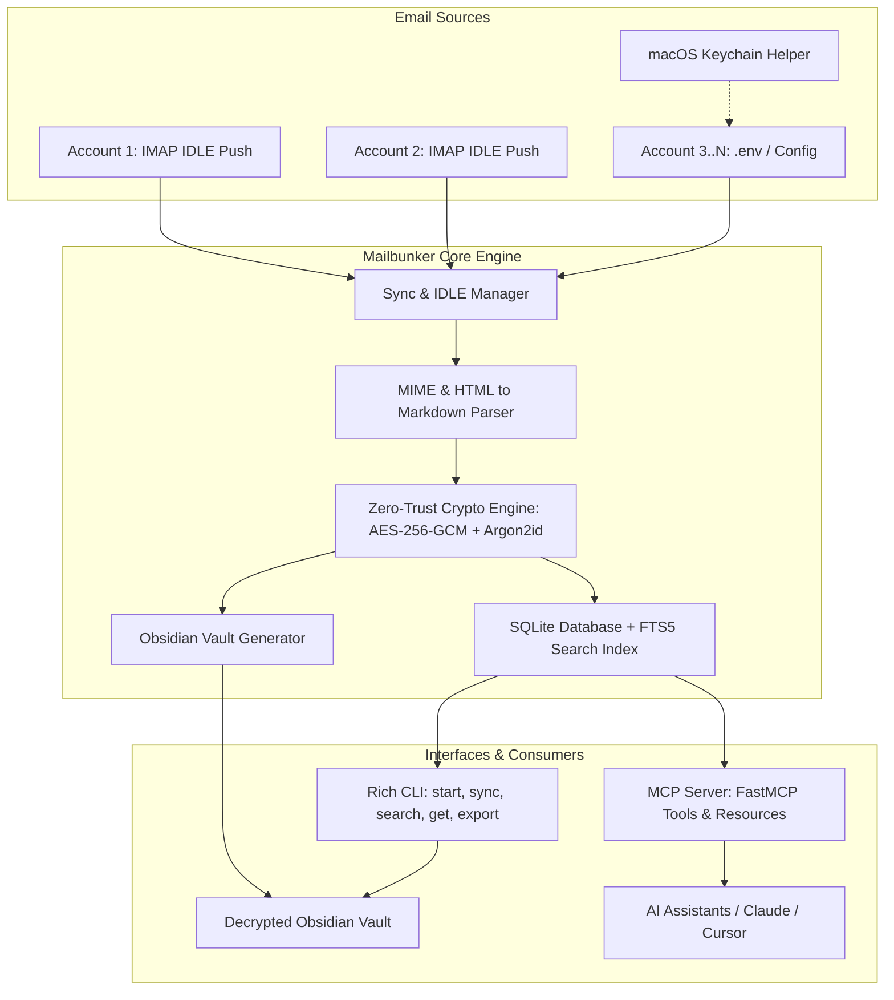

# 🔒 Mailbunker_MCP

<div align="center">

**Zero-Trust Encrypted Email Archive, Real-Time IMAP Push Ingestion (IDLE), Obsidian Vault Generator, and Model Context Protocol (MCP) Server.**

[](https://opensource.org/licenses/MIT)
[](https://www.python.org/downloads/)
[](https://modelcontextprotocol.io/)
[](#-zero-trust-security-architecture)
[](#-features)

[English](README.md) • [Deutsch](README.de.md)

</div>

---

## 📖 About Mailbunker

**Mailbunker_MCP** is an open-source, privacy-first email archiving and semantic search bunker designed to solve email clutter, vendor lock-in, and retrieval challenges once and for all.

It connects to any number of IMAP email accounts (Work, Personal, iCloud, Gmail, Posteo, Hetzner, Mailbox.org, custom servers), ingests incoming messages in real-time via **IMAP IDLE Push**, protects everything with **Zero-Trust AES-256-GCM encryption** derived from your master password using **Argon2id**, indexes all messages for **sub-millisecond full-text search (SQLite FTS5)**, and exposes standard **Model Context Protocol (MCP)** tools for Claude Desktop, Cursor, and autonomous AI agents.

---

## ✨ Features

- ⚡ **Real-Time Push Ingestion (IMAP IDLE)**:
  - Instant zero-delay email capture as soon as an email reaches your provider (RFC 2177). No delayed cron polling required.
  - Resilient automatic keepalive refresh and exponential backoff auto-reconnect.

- 🛡️ **Zero-Trust At-Rest Encryption**:
  - All email bodies (Markdown & HTML), raw headers, and binary attachments (PDFs, images, documents) are encrypted with **AES-256-GCM**.
  - Master key derivation via memory-hard **Argon2id** (`VAULT_PASSWORD`), highly resistant to GPU/ASIC brute-force attacks.
  - Zero plaintext leak on disk or in Docker volumes.

- 🔍 **Sub-Millisecond Full-Text Search (SQLite FTS5)**:
  - Search across 100,000+ emails in milliseconds.
  - Supports boolean operators (`AND`, `OR`, `NOT`), prefix matching (`tax*`), phrase search (`"contract agreement"`), and structured filters (by sender, date range, account, folder, attachment presence).
  - Rich contextual snippet generation with match highlights.

- 📓 **Obsidian-Ready Markdown Vault**:
  - Converts complex HTML emails into clean GitHub Flavored Markdown.
  - Complete YAML frontmatter metadata (`id`, `subject`, `from`, `to`, `date`, `account`, `folder`, `tags`, `attachments`).
  - Native Obsidian wikilinks for email thread tracking (`[[Parent Note]]`).
  - Export on-demand (`mailbunker export-vault`) or configure live auto-export.

- 🤖 **Model Context Protocol (MCP) Server**:
  - Native FastMCP server providing high-level tools: `search_emails`, `get_email`, `list_accounts`, `list_mailboxes`, `sync_now`, `get_sync_status`, `export_obsidian_vault`.
  - Seamlessly integrates with Claude Desktop, Cursor IDE, Antigravity, and any MCP-compliant AI assistant.

- 🔑 **Multi-Account & macOS Keychain Integration**:
  - Easy setup for 1 to 5+ email accounts via `.env` (`MAIL_1_...` through `MAIL_5_...`).
  - Interactive macOS Keychain discovery assistant (`mailbunker keychain-import`).

---

## 🏗️ Architecture



---

## 🚀 Quick Start

### 1. Installation

```bash
# Clone the repository
git clone https://github.com/cubetribe/Mailbunker_MCP.git
cd Mailbunker_MCP

# Create virtual environment and install dependencies
uv venv
source .venv/bin/activate
uv pip install -e .
```

### 2. Configuration (`.env`)

Copy the provided `.env.example` template:

```bash
cp .env.example .env
```

Edit `.env` with your settings:

```ini
# ==============================================================================
# Zero-Trust Master Password (REQUIRED)
# ==============================================================================
VAULT_PASSWORD=your-super-secure-master-password-here

# Base storage path for encrypted database and attachments
STORAGE_PATH=./data

# ==============================================================================
# Email Accounts (Configure Mail 1 through 5, or more)
# ==============================================================================
MAIL_1_ENABLED=true
MAIL_1_NAME=Work
MAIL_1_HOST=imap.example.com
MAIL_1_PORT=993
MAIL_1_USER=user@example.com
MAIL_1_PASSWORD=your_app_specific_password
MAIL_1_SSL=true
MAIL_1_FOLDERS=INBOX,Sent

MAIL_2_ENABLED=false
MAIL_2_NAME=Personal
MAIL_2_HOST=imap.posteo.de
MAIL_2_PORT=993
MAIL_2_USER=personal@posteo.de
MAIL_2_PASSWORD=your_password
MAIL_2_SSL=true
MAIL_2_FOLDERS=INBOX
```

---

## 💻 CLI Commands

Mailbunker comes with a modern, colored terminal CLI:

| Command | Description |
|---|---|
| `mailbunker start` | Launches the background daemon with IMAP IDLE push listeners for all active accounts. |
| `mailbunker sync` | Performs an immediate one-time sync of all configured mailboxes. |
| `mailbunker search "<query>"` | Searches indexed emails using full-text search (FTS5) and displays matching results. |
| `mailbunker get <id>` | Decrypts and renders a full email and its formatted Markdown in the terminal. |
| `mailbunker status` | Shows statistics: total emails, attachments, storage sizes, and encryption state. |
| `mailbunker export-vault -o <dir>` | Decrypts and exports all emails and attachments into an organized Obsidian Vault. |
| `mailbunker keychain-import` | Scans macOS Keychain for saved mail server credentials. |
| `mailbunker mcp` | Runs the Model Context Protocol (MCP) server over stdio. |

### CLI Examples

```bash
# Sync all accounts immediately
mailbunker sync

# Search for 2026 invoices
mailbunker search "invoice 2026"

# Check bunker health and statistics
mailbunker status

# Decrypt and export into an Obsidian Vault folder
mailbunker export-vault --output ~/Documents/Obsidian/MailVault
```

---

## 🤖 MCP Integration (Claude Desktop / Cursor / Antigravity)

Add Mailbunker to your MCP configuration file (e.g. `claude_desktop_config.json` or Cursor Settings):

```json
{
  "mcpServers": {
    "mailbunker": {
      "command": "uv",
      "args": [
        "--directory",
        "/path/to/Mailbunker_MCP",
        "run",
        "mailbunker-mcp"
      ],
      "env": {
        "VAULT_PASSWORD": "your-super-secure-master-password-here",
        "STORAGE_PATH": "/path/to/Mailbunker_MCP/data"
      }
    }
  }
}
```

### Available MCP Tools

- `search_emails(query, account, folder, start_date, end_date, limit)`: Fast FTS5 email search.
- `get_email(email_id, format='markdown'|'json'|'text')`: Retrieve full decrypted message.
- `list_accounts()`: List configured accounts, statuses, and counts.
- `list_mailboxes(account_name)`: List available mailbox folders.
- `sync_now(account, folder)`: Trigger immediate mailbox sync.
- `get_sync_status()`: Inspect real-time push listener status & database stats.
- `export_obsidian_vault(target_path, password)`: Decrypt and export vault.

---

## 🔒 Zero-Trust Security Architecture

```
[ Master Password: VAULT_PASSWORD ]
                 │
                 ▼ Argon2id KDF (16-byte Salt, 64MB RAM, 3 Iterations)
        [ 256-bit AES-GCM Key ]
                 │
  ┌──────────────┴──────────────┐
  ▼                             ▼
[ Email Payloads ]       [ Attachment Files ]
(Body, Headers, JSON)    (PDFs, Office Docs, Images)
  │                             │
  ▼ AES-256-GCM (IV + Tag)      ▼ AES-256-GCM (IV + Tag)
[ Encrypted SQLite DB ]  [ data/attachments/... ]
```

- **Zero-Plaintext Leak**: No email body, raw header, or binary attachment is ever stored unencrypted on disk.
- **Authenticated Encryption**: AES-256-GCM verification tags guarantee data integrity and detect tampering.
- **Argon2id Key Derivation**: High memory-cost parameters protect against offline GPU/ASIC password cracking.

---

## 🐳 Docker Deployment

Run Mailbunker in an isolated Docker container:

```bash
docker compose up -d
```

---

## 🧪 Testing

Mailbunker includes a comprehensive test suite:

```bash
source .venv/bin/activate
pytest -v
```

---

## 📄 License

MIT License — Copyright (c) 2026 [cubetribe](https://github.com/cubetribe)
