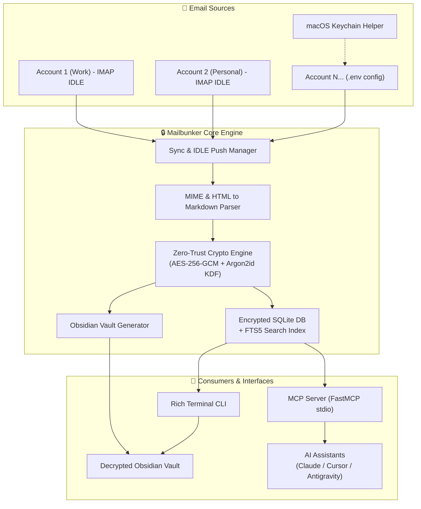

# 🔒 Mailbunker

<div align="center">

# 📬 Mailbunker MCP
### *Your Private, Zero-Trust Email Archive & AI-Powered Knowledge Vault*

**Transform your email stream into a real-time, encrypted knowledge base for Claude, Cursor, and your Second Brain.**

[](https://opensource.org/licenses/MIT)
[](https://www.python.org/downloads/)
[](https://modelcontextprotocol.io/)
[](#-zero-trust-security-architecture)
[-orange.svg)](#-features)
[](#-obsidian-second-brain)
[](CONTRIBUTING.md)

[English](README.md) • [Deutsch](README.de.md)

[✨ Features](#-features) • [💡 Why Mailbunker?](#-why-mailbunker) • [🏗️ Architecture](#-architecture) • [🚀 Quick Start](#-quick-start) • [🤖 MCP Setup](#-mcp-integration-claude--cursor--ai-agents) • [📓 Obsidian](#-obsidian-second-brain) • [💻 CLI](#-cli-commands) • [🗺️ Roadmap](#-roadmap) • [🤝 Contributing](#-contributing)

</div>

---

## 💡 Why Mailbunker?

Most email archiving solutions are either clunky corporate software, insecure cloud silos, or basic scripts that poll your inbox once every 15 minutes. 

**Mailbunker changes that:**

| Feature | Standard Cloud Archive | Traditional Mail Client | 🔒 Mailbunker MCP |
|:---|:---:|:---:|:---:|
| **Zero-Trust Encryption** | ❌ Provider has keys | ❌ Plaintext on disk | ✅ **AES-256-GCM + Argon2id** |
| **Ingestion Speed** | ⚠️ Delayed Cron Polling | ⚠️ Manual / Periodic | ⚡ **Instant IMAP IDLE Push (RFC 2177)** |
| **AI Assistant (MCP) Ready**| ❌ No | ❌ No | 🤖 **Native Model Context Protocol Server** |
| **Obsidian Second Brain** | ❌ No | ❌ No | 📓 **Bi-directional Markdown Vault + Links** |
| **Search Performance** | ⚠️ Slow cloud queries | ⚠️ Slow client search | 🔍 **Sub-millisecond SQLite FTS5** |
| **Vendor Lock-in** | ⚠️ High | ⚠️ Proprietary DBs | 🔓 **Open SQLite & Markdown formats** |

---

## ✨ Features

- ⚡ **Real-Time Push Ingestion (IMAP IDLE)**:
  - Instant, zero-delay email capture as soon as an email arrives at your provider (RFC 2177). No lagging cron polling.
  - Resilient automatic keepalive refresh and exponential backoff auto-reconnect.
  - Multi-account support (Work, Personal, Gmail, iCloud, Posteo, Mailbox.org, self-hosted, etc.).

- 🛡️ **Zero-Trust At-Rest Encryption**:
  - Every email body (Markdown & HTML), raw MIME header, and binary attachment (PDFs, images, documents) is encrypted using **AES-256-GCM**.
  - Master key derivation with memory-hard **Argon2id** (`VAULT_PASSWORD`), highly resistant to GPU/ASIC brute-force attacks.
  - Zero plaintext leak on disk or in Docker volumes.

- 🚨 **Intelligent Anti-Phishing & Injection Pre-Filter**:
  - **Three-layer deterministic filter:** Level 0 scores provider evidence (IMAP `$Junk` flag, DMARC/SPF/DKIM results, X-Spam-* headers); Level 1 adds heuristic signals (domain/display-name spoofing, homoglyph domains, dangerous attachment extensions, oversized files); Level 2 performs HTML sanitization (hidden text extraction, dangerous URI neutralization, tracking domain detection).
  - **Quarantine by default, block with caution:** Suspicious emails are quarantined for review; permanent blocking requires both a high spam score AND provider-confirmed evidence (IMAP `$Junk` flag + auth failure), preventing false-positive data loss.
  - **Hidden content isolation:** Human-invisible injected content (zero-width/opacity:0/off-screen text, class-based CSS hiding) is extracted into a separate `hidden_text` field and never indexed or exposed to the LLM, blocking prompt injection via email bodies.
  - **Configurable:** Tune `SPAM_QUARANTINE_THRESHOLD`, `SPAM_BLOCK_THRESHOLD`, and `FOLDER_DENYLIST` to match your threat model; skip syncing spam/trash folders entirely.

- 🔍 **Sub-Millisecond Full-Text Search (SQLite FTS5)**:
  - Search across 100,000+ emails in milliseconds.
  - Full boolean logic (`AND`, `OR`, `NOT`), prefix matching (`tax*`), phrase search (`"contract agreement"`), and structured filters (sender, date range, account, mailbox, attachments).
  - Rich contextual snippet generation with highlighted matches.

- 📓 **Obsidian-Ready Markdown Vault**:
  - Automatically converts complex HTML emails into clean, human-readable GitHub Flavored Markdown.
  - Complete YAML frontmatter metadata (`id`, `subject`, `from`, `to`, `date`, `account`, `folder`, `tags`, `attachments`).
  - Native Obsidian wikilinks for thread navigation (`[[Parent Note]]`).
  - Export on-demand (`mailbunker export-vault`) or configure live auto-export.

- 🤖 **Model Context Protocol (MCP) Server**:
  - Native FastMCP server providing high-level tools to Claude Desktop, Cursor, Antigravity, Windsurf, Cline, and any MCP client.
  - Ask your AI assistant to find receipts, draft replies from context, audit newsletter subscriptions, or summarize project threads.

- 🧠 **Local Ollama Classifier**:
  - Offline AI-powered email classification — spam/ham/phishing/suspicious verdicts, category detection (personal/business/transactional/marketing/newsletter/social/automated), priority tagging (high/normal/low), and auto-generated summaries.
  - Runs `mailbunker classify` on-demand or with `--backfill` to classify existing mail; never interferes with real-time IMAP IDLE push.
  - Graceful degradation: if Ollama is unavailable, classification simply skips (no crashes, no silent failures).
  - Vault frontmatter is automatically enriched with category, priority, and summary; all outputs are neutralized against prompt injection.

- 🔑 **Multi-Account & macOS Keychain Integration**:
  - Configure 1 to 5+ email accounts seamlessly via `.env` (`MAIL_1_...` through `MAIL_5_...`).
  - Interactive macOS Keychain discovery tool (`mailbunker keychain-import`) to extract credentials securely.

---

## 🏗️ Architecture



---

## 🚀 Quick Start

Get up and running in under **2 minutes**:

### 1. Installation

```bash
# Clone the repository
git clone https://github.com/cubetribe/Mailbunker_MCP.git
cd Mailbunker_MCP

# Create a virtual environment and install Mailbunker (using uv or pip)
uv venv
source .venv/bin/activate
uv pip install -e .
```

### 2. Configure Your Bunker (`.env`)

Copy the template configuration:

```bash
cp .env.example .env
```

Open `.env` and set your master password and email credentials:

```ini
# ==============================================================================
# Zero-Trust Master Password (REQUIRED)
# ==============================================================================
VAULT_PASSWORD=your-super-secure-master-password-here

# Base storage path for encrypted database and attachments
STORAGE_PATH=./data

# ==============================================================================
# Email Accounts (Configure Mail 1 through 5, or more)
# ==============================================================================
MAIL_1_ENABLED=true
MAIL_1_NAME=Work
MAIL_1_HOST=imap.example.com
MAIL_1_PORT=993
MAIL_1_USER=user@example.com
MAIL_1_PASSWORD=your_app_specific_password
MAIL_1_SSL=true
MAIL_1_FOLDERS=INBOX,Sent

MAIL_2_ENABLED=false
MAIL_2_NAME=Personal
MAIL_2_HOST=imap.posteo.de
MAIL_2_PORT=993
MAIL_2_USER=personal@posteo.de
MAIL_2_PASSWORD=your_password
MAIL_2_SSL=true
MAIL_2_FOLDERS=INBOX
```

### 3. Sync & Run

```bash
# 1. Run an immediate initial sync
mailbunker sync

# 2. Search your emails instantly
mailbunker search "invoice 2026"

# 3. Start the background real-time push listener
mailbunker start
```

---

## 🤖 MCP Integration (Claude / Cursor / AI Agents)

Turn your AI assistant into an email genius with direct, secure access to your indexed email vault.

### 1. Claude Desktop Configuration

Add Mailbunker to `~/Library/Application Support/Claude/claude_desktop_config.json` (macOS) or `%APPDATA%/Claude/claude_desktop_config.json` (Windows):

```json
{
  "mcpServers": {
    "mailbunker": {
      "command": "uv",
      "args": [
        "--directory",
        "/absolute/path/to/Mailbunker_MCP",
        "run",
        "mailbunker-mcp"
      ],
      "env": {
        "VAULT_PASSWORD": "your-super-secure-master-password-here",
        "STORAGE_PATH": "/absolute/path/to/Mailbunker_MCP/data"
      }
    }
  }
}
```

### 2. Cursor IDE & Cline / Windsurf / Antigravity

Add Mailbunker as an MCP stdio server in your editor settings (`.cursor/mcp.json` or MCP settings tab):

```json
{
  "mcpServers": {
    "mailbunker": {
      "command": "mailbunker-mcp",
      "env": {
        "VAULT_PASSWORD": "your-super-secure-master-password-here",
        "STORAGE_PATH": "/absolute/path/to/Mailbunker_MCP/data"
      }
    }
  }
}
```

### 🛠️ Available MCP Tools

| Tool | Parameters | Description |
|---|---|---|
| `search_emails` | `query`, `account`, `folder`, `start_date`, `end_date`, `limit` | Sub-millisecond FTS5 search across all decrypted mail metadata and body content. Results include a `_notice` field reminding clients that email content is untrusted. |
| `get_email` | `email_id`, `format` (`markdown` \| `json` \| `text`) | Retrieve full decrypted email body, headers, and attachment list. All text fields are sanitized to remove control, zero-width, and bidirectional override characters. **Note:** `format="json"` no longer includes `body_html` or `raw_headers` for security; use `format="markdown"` or `format="text"` instead. |
| `list_accounts` | *(none)* | List configured mail accounts, connection statuses, and total indexed counts. |
| `list_mailboxes` | `account_name` | List available mailbox folders for a specific account. |
| `sync_now` | `account`, `folder` | Trigger an immediate on-demand IMAP sync. |
| `get_sync_status` | *(none)* | Inspect real-time push listener health and database statistics. |
| `export_obsidian_vault`| `target_path` *(required)*, `password` *(required)* | Decrypt and export your entire archive to an Obsidian-ready folder. **Password is now mandatory** — the master password (`VAULT_PASSWORD`) must be provided. The `target_path` must be within the configured Obsidian vault directory (or whitelisted via `export_allowed_roots`). |

### 💬 What You Can Ask Your AI:

> *"Find all tax invoices from January 2026 and summarize the total amount and VAT."*  
> *"What were the key decisions in the email thread with Sarah regarding the Q3 budget?"*  
> *"List all active newsletters I received this month and draft an unsubscribe list."*  

---

## 📓 Obsidian Second Brain

Mailbunker bridges the gap between your inbox and your personal knowledge base:

```
Obsidian_Vault/
├── 📁 Work/
│   ├── 📁 INBOX/
│   │   ├── 📄 2026-08-20_Project_Kickoff.md
│   │   └── 📄 2026-08-21_Contract_Approval.md
│   └── 📁 Sent/
├── 📁 Personal/
└── 📁 attachments/
    ├── 📎 invoice_9841.pdf
    └── 📎 architecture_diagram.png
```

### Frontmatter Example:

```yaml
---
id: msg_a9f82d1c
subject: "Project Phoenix Kickoff & Roadmap"
from: "sarah@company.com"
to: ["dev-team@company.com"]
date: 2026-08-21T09:30:00Z
account: "Work"
folder: "INBOX"
thread_id: "thread_44921"
in_reply_to: "[[2026-08-20_Initial_Briefing]]"
tags:
  - email
  - Work
  - project-phoenix
attachments:
  - "attachments/msg_a9f82d1c/spec_v1.pdf"
---

# Project Phoenix Kickoff & Roadmap

Hey Team,

Here is the updated timeline for **Project Phoenix**...
```

Export your vault at any time:
```bash
mailbunker export-vault --output ~/Documents/Obsidian/EmailVault
```

---

## 💻 CLI Commands

Mailbunker comes with a modern, colorful terminal interface:

| Command | Description |
|---|---|
| `mailbunker start` | Launches the background daemon with IMAP IDLE push listeners for all active accounts. |
| `mailbunker sync` | Performs an immediate one-time sync of all configured mailboxes. |
| `mailbunker search "<query>"` | Searches indexed emails using full-text search (FTS5) with highlighted snippets. |
| `mailbunker get <id>` | Decrypts and renders a full email and its formatted Markdown in your terminal. |
| `mailbunker status` | Shows statistics: total emails, attachments, storage sizes, and encryption state. |
| `mailbunker export-vault -o <dir>` | Decrypts and exports all emails and attachments into an organized Obsidian Vault. |
| `mailbunker keychain-import` | Scans macOS Keychain for saved mail server credentials. |
| `mailbunker mcp` | Runs the Model Context Protocol (MCP) server over stdio. |

---

## 🔒 Zero-Trust Security Architecture

```
[ Master Password: VAULT_PASSWORD ]
                 │
                 ▼ Argon2id KDF (16-byte Salt, 64MB RAM, 3 Iterations)
        [ 256-bit AES-GCM Key ]
                 │
   ┌─────────────┴─────────────┐
   ▼                           ▼
[ Email Payloads ]      [ Attachment Files ]
(Body, Headers, JSON)   (PDFs, Office Docs, Images)
   │                           │
   ▼ AES-256-GCM (IV + Tag)    ▼ AES-256-GCM (IV + Tag)
[ Encrypted SQLite DB ] [ data/attachments/... ]
```

- **Zero-Plaintext Leak**: No email body, raw header, or binary attachment is ever written unencrypted to disk.
- **Authenticated Encryption**: AES-256-GCM authentication tags guarantee data integrity and detect file tampering.
- **Argon2id Key Derivation**: High memory-cost parameters protect against offline GPU/ASIC password cracking.

---

## 🐳 Docker Deployment

Run Mailbunker in a containerized environment with Docker Compose:

```bash
docker compose up -d
```

Check the container logs:
```bash
docker compose logs -f
```

---

## 🧪 Testing

Mailbunker maintains a comprehensive automated test suite:

```bash
# Run unit & integration tests
pytest -v

# Run with coverage
pytest --cov=mailbunker tests/
```

---

## 🗺️ Roadmap

We have ambitious plans to make Mailbunker the ultimate email knowledge bunker! Here is what's coming:

- [ ] **Hybrid Search**: Combine SQLite FTS5 (keyword) with local Vector Embeddings (semantic search) via sqlite-vec / sentence-transformers.
- [ ] **Webhooks & Automation**: Trigger n8n, Zapier, or local scripts whenever matching emails arrive.
- [ ] **Native PGP / GPG Decryption**: Seamlessly decrypt PGP-encrypted emails inside the vault.
- [ ] **Lightweight Web UI**: An optional local dashboard for browsing encrypted archives from any local browser.
- [ ] **Multi-App Exporters**: Direct exporters for Logseq, Notion, and Joplin.
- [ ] **Auto-Labeling & Categorization via Local LLMs**: Automatic tag generation using Ollama / llama.cpp.

---

## 🤝 Contributing

We ❤️ contributions from the community! Whether you are:
- 🐛 Fixing a bug or reporting an issue
- 💡 Proposing a new feature or MCP tool
- 📝 Improving documentation or adding translations
- 🔒 Performing security reviews or crypto audits

Please check out our [Contributing Guide](CONTRIBUTING.md) to get started.

### 🌟 Show Your Support

If you find Mailbunker useful or believe in private, local-first AI tools, **give us a star on GitHub!** ⭐ It motivates the team and helps other privacy-conscious developers discover the project.

---

## 📄 License

Distributed under the **MIT License**. See [LICENSE](LICENSE) for more information.

Developed with ❤️ by [cubetribe](https://github.com/cubetribe) and the open-source community.
